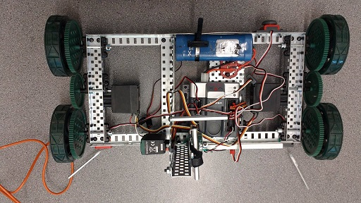
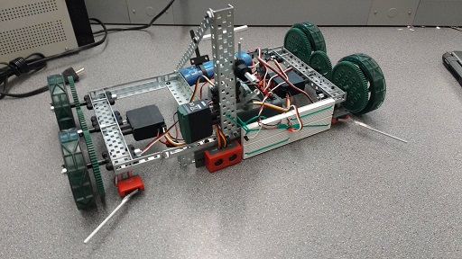

# engr120 - RobotC Robotics
ENGR 120 @ UVIC involved assembling hardware and electrical sensor components into a usable multi-stage robot to solve an "underwater" cable connection.

Team mates:
Tanner Robertson
Isaac McRae

